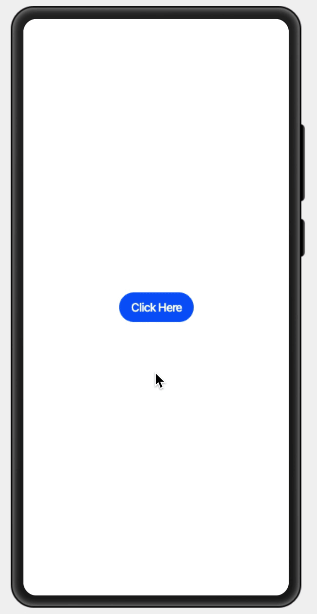
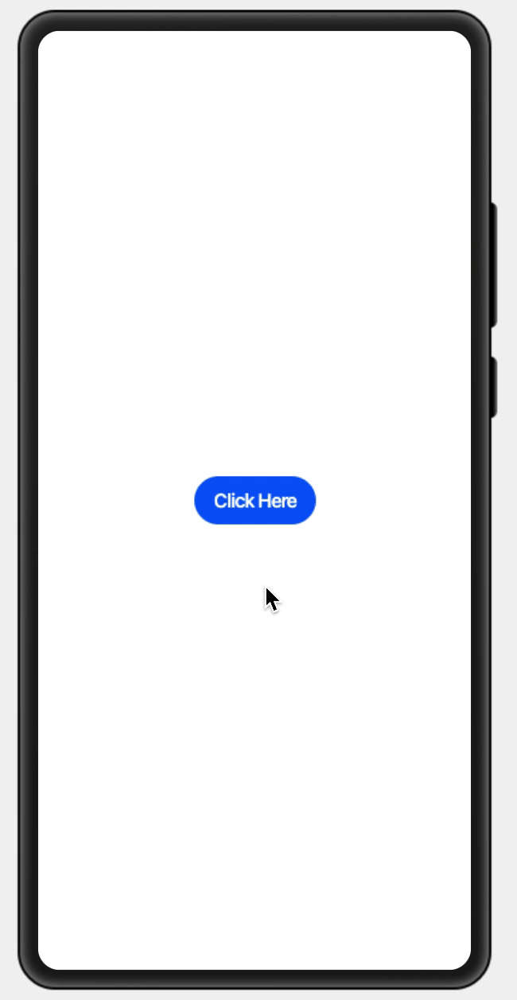
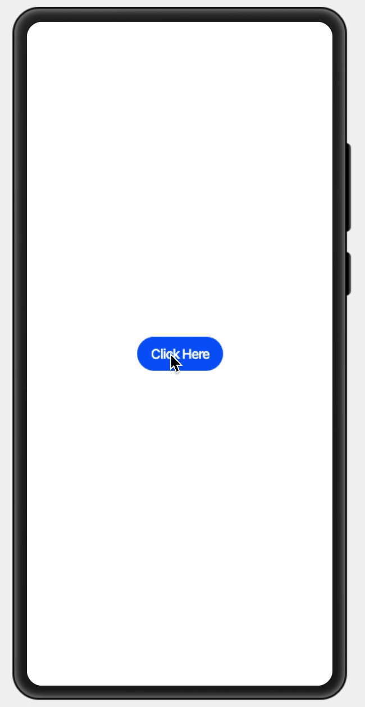

# 背景

随着 `OpenHarmony` 组件开发大赛结果公布，我们的团队成员被告知获得了二等奖，在开心之余也想将我们这段时间宝贵的开发经验写下来与大家分享，当我们看到参赛通知的时候已经是 9 月中旬的时候，此时已经是作品可以提交的时间了，参考了一些其他作品发现，基于 `Canvas` 开发的组件目前还没有，那我们就开始计划写一个基于 `Canvas` 和通用组件一起开发的组件，在这之前由于并没有开发过 `OpenHarmony` 应用，我们团队成员都没有相关的经验，大家从零开始在摸索，我们首先分工合作，有的成员负责去下载 `IDE` 和调试设备，有的成员负责研究和阅读官方文档。

# 配置

在阅读完官方文档之后，我们成员分别在自己本地电脑和设备上做了以下的环境配置：

1. 下载并安装好 [DevEco Studio 2.1 Release](https://developer.harmonyos.com/cn/develop/deveco-studio#download) 及以上版本
2. 获取 [OpenHarmony SDK](https://mirror.iscas.ac.cn/OpenHarmony/sdk/OpenHarmony-SDK-2.0-Canary.7z) 包并解压
3. 配置 `OpenHarmony SDK`

在 `DevEco` 主界面，点击工具栏中的 `File` > `Settings` > `Appearance & Behavior` > `System Settings` > `HarmonyOS SDK` 界面，点击 `HarmonyOS SDK Location` 加载 `SDK`：


然后一直点击 `Next` 和 `Finish` 完成环境配置。

4. 安装额外包，进入 `OpenHarmony-SDK-2.0-Canary/js/2.2.0.0/build-tools/ace-loader` 目录，然后在该目录下运行命令行工具，分别执行如下命令，直至安装完成

```bash
npm cache clean -f
npm install
```

5. 下载 [OpenHarmonyJSDemos](https://gitee.com/isrc_ohos/open-harmony-js-demos) 项目工程，将工程导入 `DevEco Studio`
6. 申请并配置证书，注意 `OpenHarmony` 与 `HarmonyOS` 的证书不通用，所以需要额外进行申请
7. 进行编译构建，生成一个 `HAP` 应用安装包，生成 `HAP` 应用安装包，安装到 `OpenHarmony` 开发板
8. 安装运行后，在开发板屏幕上点击应用图标即可打开应用，即可在设备上查看应用示例运行效果，以及进行相关调试
9. 除了使用真机调试，我们还可以使用远程调试和本地的 `Previewer` 调试，虽然非常相当方便，但实际表现肯定和真机是有稍微差异的


# 前言

在实现 `Canvas` 应用之前，我们经过一些商量和讨论，首先是希望能借助这一次开发提升对 `OpenHarmony` 的理解，方便后续业务的支持，其次我们团队成员也是希望能拿到比较好的名次和奖励，我们注意到比赛的评分由评委打分，满分为 100 分，这里会根据作品的创意性、实用性、用户体验、代码规范等四个维度点评打分，`Canvas` 的应用首先实现成本会比普通应用难度稍微大点，并且不好调试，在创意性和实用性上我们优势不大，因为大部分前端开发者接触到的 `Canvas` 应用都是游戏相关的，所以这条路注定是会相对艰难的，用户体验也是一个很大的难点，我们真机测试发现 `Canvas` 的表现也不是很好，比原生一些组件的体验差很多，对于团队成员的代码质量是有信心的，但是代码规范的评分比重却是最少的，所以在立项的时候我们有比较大的分歧。

| 评选维度 | 说明                                                 | 分值 |
| -------- | ---------------------------------------------------- | ---- |
| 创意性   | 作品的创新程度                                       | 30%  |
| 实用性   | 作品在应用场景中的实际应用程度                       | 30%  |
| 用户体验 | 用户体验价值，用户能够轻松使用组件，并获得良好体验感 | 25%  |
| 代码规范 | 代码的质量，美观度，是否符合规范                     | 15%  |

# 计划

正因为由上面总总的疑虑，我们先制定了三个计划和一个目标：

- 使用基础组件和容器组件等实现通用组件 - [OpenHarmonyGallery](https://gitee.com/wscats/OpenHarmonyGallery)
- 使用画布组件实现 `Canvas` 游戏 - [OpenHarmonyFlappyBird](https://gitee.com/wscats/OpenHarmonyFlappyBird)
- 使用基础组件，容器组件和画布组件实现 `Canvas` 渲染引擎 - [OpenHarmonySheet](https://github.com/Wscats/sheet)

渲染引擎是我们最终目标，虽然难度偏大，但我们团队成员决定分开三步来实现该目标，首先至少先学会使用基础组件和容器组件，然后再学会使用画布组件，最后综合这些经验实现一个渲染引擎。

# 初体验

我们首先实现了一个通用的画廊组件来作为练手项目，它主要使用了四个基础组件和容器组件：

我们放置一个按钮来触发 `showGallery` 方法，该方法控制 `panel` 弹出式组件的显示和隐藏，这里的 `div` 和 `button` 标签就是 `hml` 内置的组件，跟我们平常写 `html` 很相似，它支持我们大部分的常规属性如 `id` ，`class` 和 `type` 等，方便我们用来设置组件基本标识和外观特征显示。

```html
<div class="btn-div">
  <button type="capsule" value="Click Here" onclick="showGallery"></button>
</div>
```

然后我们 `panel` 组件中放置可变更的画廊内容展示窗口，并让 `mode` 和 `src` 变成可设置的变量，这样画廊组件就能根据模式让画廊组件显示不同的形态，根据传入的图片地址显示不同的图片内容，这里的语法跟微信小程序很和 `Vue` 框架相似，都可以使用 `Mustache` 语法来控制属性值。

```html
<panel
  id="gallery"
  class="gallery"
  type="foldable"
  mode="{{modeFlag}}}"
  onsizechange="changeMode"
>
  <div class="panel-div" onclick="closeGallery">
    <image class="panel-image" onclick="closeGallery" src="{{galleryUrl}}}"></image>
    <button
      class="panel-circle"
      onclick="closeGallery"
      type="circle"
      icon="/common/images/close.svg"
    ></button>
  </div>
</panel>
```

实现完视图和布局之后，我们就可以在同级目录下 `index.js` 中补充画廊组件的逻辑，由于支持 `ES6` 语法，我们写的也很舒服很高效，这里的 data 是画廊组件的数据模型，类型可以是对象或者函数，如果类型是函数，返回值必须是对象，注意属性名不能以 `$` 或 `_` 开头，不要使用保留字，我们在这里给 `modeFlag` 和 `galleryUrl` 设置默认值。

```js
export default {
  data: {
    modeFlag: "full",
    galleryUrl:
      "https://pic1.zhimg.com/v2-3be05963f5f3753a8cb75b6692154d4a_1440w.jpg?source=172ae18b",
  },
};
```

而显示和隐藏逻辑比较简单，只需要获取 `panel` 的节点，然后触发 `show` 或者 `hide` 方法即可，当然除了该方法，我们还可以使用 `渲染属性` 来实现：

- `for` 根据设置的数据列表，展开当前元素
- `if` 根据设置的 `boolean` 值，添加或移除当前元素
- `show` 根据设置的 `boolean` 值，显示或隐藏当前元素

```js
showGallery(e) {
    this.$element('gallery').show()
},
closeGallery(e) {
    if(e.target.type==='image') return
    this.$element('gallery').close()
},
```

我们还可以在同级目录下在 `index.css` 补充组件的样式，可以让我们的画廊呈现更好的效果，这里动画样式还支持动态的旋转、平移、缩放和渐变效果，均可在 `style` 或 `css` 中设置。

```css
.panel-div {
  width: 100%;
  height: 100%;
  flex-direction: column;
  align-items: center;
  justify-content: center;
}
```

整体实现的效果如下图所示，效果简单粗暴，写完了这个 `DEMO` 之后，我们团队成员对 `OpenHarmony` 的基础组件运用有了最基本的了解：

<div>



</div>

<br/>
<br/>

# 进阶

虽然上面我们掌握了最基础的组件使用，但我们还是没使用到 `Canvas` 画布组件，所以我们继续翻阅官方文档，发现 `OpenHarmony` 是提供了齐全的画布接口：


我们使用经典 `FlappyBird` 游戏作为我们画布组件的第一次尝试。

## 收集素材

首先我们先准备好游戏的图片和动画素材：

|      | 素材                                                                                                                                                                                                                              |
| ---- | --------------------------------------------------------------------------------------------------------------------------------------------------------------------------------------------------------------------------------- |
| 背景 |                                                                                                                               |
| 小鸟 |                                                                                                                               |
| 地面 |                                                                                                                               |
| 水管 |   |

然后我们准备好画布，设置好高度和宽度，并监听画布按下的方法 `ontouchend`。

```html
<div class="container">
  <canvas ref="canvas" style="width: 280px; height: 512px;" ontouchend="moveUp"></canvas>
</div>
```

## 数据初始化

准备好画布之后，我们就需要初始化游戏的初始数据，核心的主要涉及几个：

| el              | 画布元素      |
| --------------- | ------------- |
| gap             | 管道间距      |
| score           | 得分          |
| bX              | 小鸟 X 轴坐标 |
| bY              | 小鸟 Y 轴坐标 |
| gravity         | 重力指数      |
| pipe            | 管道数据      |
| birdHeight      | 小鸟高度      |
| birdWidth       | 小鸟宽度      |
| pipeNorthHeight | 上侧管道高度  |
| pipeNorthWidth  | 下侧管道高度  |
| cvsHeight       | 画布高度      |
| cvsWidth        | 画布宽度      |
| fgHeight        | 地面高度      |
| fgWidth         | 地面宽度      |

实现这个游戏之前，我们不但需要掌握基础的组件，还需要了解一部分生命周期，`OpenHarmony` 有两种生命周期，分别是应用生命周期和页面生命周期，我们这里第一次运用到生命周期 `onShow`，它是在页面打开的时候触发，并且应用处于前台时触发，我们需要它在开始的时候帮我们初始化一些关键数据，获取画布的节点，保存画布的上下文作用域 `ctx` ，清空管道数据和触发游戏帧绘制。

```js
onShow() {
    this.el = this.$refs.canvas;
    this.ctx = this.el.getContext('2d');
    this.pipe[0] = {
        x: this.cvsWidth,
        y: 0,
    };
    requestAnimationFrame(this.draw);
},
```

这里的 `this.draw` 方法是整个游戏的核心逻辑，涉及小鸟的飞行动画，运动轨迹，边界处理和得分计算。

首先我们从画布的左上角 `X` 和 `Y` 轴的起始位置开始绘制游戏的背景。

```js
const ctx = this.ctx;
ctx.drawImage(this.bg, 0, 0);
```

然后我们绘制小鸟飞行过程中出现在天空和地面的管道，这里需要计算天空的管道位置，上管道的位置需要用两个管道预设的间距加上下管道的高度的出来的，当位置计算出来后，只需要配合定时器或者 `requestAnimationFrame` 来实时更新管道和鸟的位置就能让用户感知游戏动态画面的效果，这里我使用了 `requestAnimationFrame` 请求动画帧体验会更好，但是它从 `API Version 6` 才开始支持，并且不需要你导入，所以读者需要留意你的 `SDK` 是否是比较新的版本。

```js
for (let i = 0; i < this.pipe.length; i++) {
  this.constant = this.pipeNorthHeight + this.gap;
  ctx.drawImage(this.pipeNorth, this.pipe[i].x, this.pipe[i].y);
  ctx.drawImage(this.pipeSouth, this.pipe[i].x, this.pipe[i].y + this.constant);
  this.pipe[i].x--;
}
```

## 碰撞检测

这里我们使用一个条件判断来做边界处理即碰撞检测，也就是小鸟如果碰到地面，碰到天空的管道或者地面的管道就会使所有动画停止，即游戏结束，如果游戏结束则结算成绩，并且使用 `OpenHarmony` 内置的弹窗提醒玩家是否需要重新开始新的游戏。

```js
if (
  (this.bX + this.birdWidth >= this.pipe[i].x &&
    this.bX <= this.pipe[i].x + this.pipeNorthWidth &&
    (this.bY <= this.pipe[i].y + this.pipeNorthHeight ||
      this.bY + this.birdHeight >= this.pipe[i].y + this.constant)) ||
  this.bY + this.birdHeight >= this.cvsHeight - this.fgHeight
) {
  prompt.showDialog({
    buttons: [{ text: "重来一次" }],
    success: (data) => this.restart(),
  });
  clearInterval(this.interval);
}
```

当处理完边界，我们还需要处理当小鸟一直飞下去的时候，要不断创建新的管道，回收旧管道算得分，这个逻辑也相当之简单，本质上也算是一种碰撞检测，当管道位置变更到画面左侧 `X` 轴为 `5` 的位置，即小鸟已经安全通过，则成功得分，当最新的管道变更到画面右侧 `X` 轴为 `125` 的位置，即小鸟将要飞跃的下一个管道，则提前创建好下一个新的管道，如果小鸟飞跃的距离比较长，我们还需要考虑优化管道数组，不能让数组无限制的增长下去，我们还可以优化，所以当旧管道已经完全消失在画面中的时候，我们可以考虑把旧管道的数据从数组中删除。

```js
if (this.pipe[i].x == 125) {
  this.pipe.push({
    x: this.cvsWidth,
    y: Math.floor(Math.random() * this.pipeNorthHeight) - this.pipeNorthHeight,
  });
}
if (this.pipe[i].x == 5) {
  this.score++;
}
```

上面所有的这些逻辑本质都是绘制管道的动画，我们配合偏移量和重力因素，很轻易的就能绘制出小鸟的飞行轨迹，我们这里还顺便把得分绘制到屏幕的左下角，以便实时展示玩家得分。

```js
ctx.drawImage(this.fg, 0, this.cvsHeight - this.fgHeight);
ctx.drawImage(this.bird, this.bX, this.bY);
this.bY += this.gravity;
ctx.fillStyle = "#000";
ctx.font = "20px Verdana";
ctx.fillText("Score : " + this.score, 10, this.cvsHeight - 20);
```

## 操作和计分

而我们玩家参与整个游戏只需要一个操作，就是用手指点击屏幕，尽量让小鸟安全飞过管道之间，所以我们需要监听屏幕的点击事件，本质也就是画布的点击事件，当用户点击一下的时候，我们就让小鸟往上方移动一点距离。

```js
moveUp() {
    this.bY -= 25;
},
```

而重置游戏跟初始化的逻辑很相似，只要把玩家得分，鸟的位置和管道的数据全部恢复到默认状态即可：

```js
restart() {
    this.pipe = [];
    this.pipe[0] = {
        x: this.cvsWidth,
        y: 0,
    };
    this.constant = 0;
    this.score = 0;
    this.bY = 150;
},
```

## 封装组件

<div>


</div>

由于比赛要求我们是实现一个通用组件，所以在案例 2 中我们希望更进一步，尝试把这个把这个游戏封装成一个通用的组件，查阅官方文档发现实现起来很简单，详情在[自定义组件](https://developer.harmonyos.com/cn/docs/documentation/doc-references/js-components-custom-basic-usage-0000000000611781)，所谓自定义组件就是是用户根据业务需求，将已有的组件组合，封装成的新组件，可以在工程中多次调用，从而提高代码的可读性。综上所述，我们只需要使用 `<element>` 组件把我们刚才实现的组件引入到宿主页面即可。

```html
<element name="Flappy" src="./flappy//pages//index/index.hml"></element>
<div class="container">
  <Flappy></Flappy>
</div>
```

# 终极挑战

有了前面两个案例的积累，我们团队对 `OpenHarmony` 开发有了更清晰的认识，就要进入最后激动人心的终极挑战了，我们要完整的移植一个 `Canvas` 引擎，我们一开始考虑的是实现一个游戏引擎，但考虑到比赛剩余时间并不足够，并且游戏引擎的实用性和创意性不利于展现，所以经过我们团队综合考量，我们最终决定实现一个文档表格渲染引擎。


## 思考

可能有人疑问为什么会选择移植一个文档渲染引擎，这里想起外网知乎有过类似的讨论，[中国要用多久才能研发出类似 Excel，且功能涵盖 Excel 95% 功能的替代软件？](https://www.zhihu.com/question/274242420)，这条路很崎岖很艰难，引用最高赞一些大 V 的回答吧：

- `微软轮子哥`：做不出来的，那么多东西，要把需求文档写好都得好几年。
  微软的 Belleve：各位程序员可以试试先实现下 recalc（根据公式更新单元格数值），就知道难度了，文档项目作为国内最复杂的 C++ 项目绝非浪得虚名。
- `微软的妖怪弟弟`：作为 Excel 的工程师，哥认真的答一个，不能，因为我们隔壁组已经尝试过了，两年大概覆盖了 40%上下吧。
- `IBM 的 Caspar Cui`：如果是开发常用的 Excel 功能的话， WPS 已经是很好的替代品了。而且微软和金山也有交叉授权。但是说要提到 95%功能的 Excel 已经做到了这种事儿。。。还是有点小瞧 Excel 了。就一个帮助文档量，WPS 也得多努力。
- `中科大的 Sixue`：假如微软脑抽，把 Excel 源码弄丢了，不可恢复了。那就是世界末日，大家一起完蛋。哪怕微软把 Excel 团队原班人马找回来，离职的反聘，英年早逝的复活，然后重新开发一个 Excel。他也没办法保证把 Excel 的功能恢复到 95%，没法保证 95%的 Excel 文件正常打开。
- `Bbcallen`：不可能的，微软自己都做不到。

不管任何人怎么说，这条路我们也必须走，就如鸿蒙诞生背后的意义，我们选择去迎接这个挑战，这里面的每一个坎每一个坑都值得留下一个中国人的脚印。

从技术和目标角度理性去看，我们更应该实现的不是已经固化了市场和用户习惯的本地个人文档而是在线协同文档，本地文档只需考虑个人，不需要考虑多人协同场景，只需要考虑离线，不需要考虑在线场景，只需要考虑客户端场景，不需要考虑服务器场景等...

在线文档的宿主环境是浏览器，本地文档背后是系统，国内任何在线文档背后都没有像谷歌文档基于谷歌浏览器的支持，没有微软 `Office` 基于微软 `Windows` 系统的支持，事实上基于这一切我们也该清醒认识到，做到 `95%` 是很难的。要知道谷歌为了开发浏览器前后投入了十几年上千人上百亿，微软 `Windows` 系统就更不用说了，在国内我们可能拥有不了这样的技术背景，但我们仍在努力缩小差距顽强追赶。

## 实现方案

在谈谈实现方案之前，**我们先讲讲表格渲染有多复杂**，表格的渲染一般来说有两种实现方案：

- `DOM` 渲染。
- `Canvas` 渲染。

业界比较出名的 `handsontable` 开源库就是基于 `DOM` 实现渲染，同等渲染结果，需要对 `DOM` 节点进行精心的设计与构造，但显而易见十万、百万单元格的 `DOM` 渲染会产生较大的性能问题。因此，如今很多在线表格实现都是基于 `Canvas` 和叠加 `DOM` 来实现的，但使用 `Canvas` 实现需要考虑可视区域、滚动操作、画布层级关系，也有 `Canvas` 自身面临的一些性能问题，包括 `Canvas` 如何进行直出等，对开发的要求较高，但为了更好的用户体验，更倾向于 `Canvas` 渲染的实现方案。

由于大部分前端项目渲染层是使用框架根据排版模型树结构逐层渲染的，整棵渲染树也是与排版模型树一一对应。因此，整个渲染的节点也非常多。项目较大时，性能会受到较大的影响。


为了提升渲染性能，提供更优质的编辑体验从 `DOM` 更换成 `Canvas` 渲染，方便开发者构建重前端大型在线文档项目，**在国内外实现类似引擎的公司仅仅只有几家**，如：腾讯文档，金山文档和谷歌文档等。

| 顶层 |        |                  |
| ---- | ------ | ---------------- |
| ↑    | DOM    | 容器插件输入框等 |
| ↑    | Canvas | 高亮选区等       |
| ↑    | Canvas | 内容字体背景色等 |
| 底层 |        |                  |

我们通过分类收集视图元素，再进行逐类别渲染的方式，减少 `Canvas` 绘图引擎切换状态机的次数，降低性能损耗，优化渲染耗时，整个核心引擎代码控制在 `1500` 行左右，另补充演示代码 `500` 行，方便大家理解阅读和进行二次开发。

这里移植的引擎主要参考了一个商业项目和一个开源项目：

- [X Spreadsheet@MyLiang](https://github.com/myliang/x-spreadsheet)
- [Tencent Doc@AlloyTeam](https://docs.qq.com)

## 画布初始化

我们构造一个 `table` 类，在初始化的时候创建画布，并设置好高度和宽度，并放入 `DOM` 中，并把常用的属挂载到原型链上并暴露到全局 `window` 变量上。

```js
class Table {
  constructor(container, width, height) {
    const target = document.createElement("canvas");
    document.querySelector(container).appendChild(target);
    this.$target = target;
    this.$draw = Canvas2d.create(target);
    this.$width = width;
    this.$height = height;
  }
}
```

我们就可以，页面中在 `<div id="table"></div>` 放置好表格元素，全局环境中直接实例化该画布，这里组件通过 `id` 属性标识后，可以使用该 `id` 获取组件对象并调用相关组件方法。

```js
const table = new Table("#table", 800, 500);
```

|          |             |             |
| -------- | ----------- | ----------- |
| 左上区域 | col 列      | col 列      |
| row 行   | cell 单元格 | cell 单元格 |
| row 行   | cell 单元格 | cell 单元格 |

## 坐标系建立

有了画布，我们就要开始筹备渲染，我们 `table` 类里面封装 `render` 方法，`render` 方法主要绘制四个区域，也就是类似数学上的**笛卡尔直角坐标系**的四个想象，涉及格子线段，格子的信息，列头部（A-Z 列），行头部和冻结区域。

| 2 - 左上区域 | 1 - 右上区域 |
| ------------ | ------------ |
| 3 -左下区域  | 4 - 右下区域 |

这些 `area` 都是通过 `area.js` 的 `Area` 初始化而来

- 2 区域至 1 区域就是 A-Z 列头部
- 2 区域至 3 区域就是行头部
- 4 区域最常用，是可编辑的单元格

```js
renderBody.call(this, draw, area4);
renderRowHeader.call(this, draw, iarea3);
renderColHeader.call(this, draw, iarea1);
renderFreezeLines.call(this, draw, area4.x, area4.y);
```

而这个四个区域大部分的核心思路本质都是绘制格子，所有都共同用到 `renderLinesAndCells` 方法，里面分别有用于绘制区域的线条和格子信息的方法，里面的 `renderCells` 会遍历区域然后触发 `renderCell` 绘制每一个单独的单元格，这里还会处理一些特殊的单元格，比如合并的单元格和选中的单元格，而 `renderLines` 则会遍历每行每列去绘制所有行列的间隔线。

```js
function renderLinesAndCells() {
  renderLines(draw, area, lineStyle);
  renderCells(draw, type, area, cell, cellStyle, selection, selectionStyle, merges);
}
```

## 单元格渲染

绘制了表格的单元格之后，就需要往每个单元格渲染数据和格式了，这里在 `Table` 原型链上挂载了一个 `cell` 方法，它接受一个回调函数并把它存到静态属性 `$cell` 上，当 `renderCell` 函数触发的时候就会调用这个方法并把行列号传入 `$cell` 方法中获取单元格的信息。

```js
Table.prototype["cell"] = function (callback) {
  this[`$$cell`] = callback;
  return this;
};
const sheet = [
  ["1", "1", "1"],
  ["1", "0", "1"],
  ["1", "1", "1"],
];
table.cell((ri, ci) => sheet?.[ri]?.[ci] || "").render();
```


所以我们可以通过暴露的 `$cell` 方法控制每个单元格的文字信息和单元格样式，当然这里支持你只传入纯文本，也支持你传入复杂数据结构来装饰单元格，这里的 `style` 会有默认的值来自于 `$cellStyle`。

| bgcolor   | #ffffff         |
| --------- | --------------- |
| align     | left            |
| valign    | middle          |
| textwrap  | true            |
| underline | false           |
| color     | #0a0a0a         |
| bold      | false           |
| italic    | false           |
| rotate    | 0               |
| fontSize  | 9               |
| fontName  | Source Sans Pro |

这些样式本质是使用 `Canvas` 提供的接口 `draw.attr()` 来展示的。

```js
const c = cell(ri, ci);
let text = c.text || "";
let style = c.style;
cellRender(draw, text, cellRect, style);
```

有上面最基础的方法，我们已经拥有表格数据展示的功能，此时我们可以暴露更丰富的接口给第三方使用，比如常用的合并单元格，我们调用 `merges` 方法告知 `table` 类，我们在 `X` 轴 `G9` 至 `H11` 到 `Y` 轴 `B9` 至 `D11` 的范围里面的单元格是被合并的状态，

```js
Table.create("#table", 800, 500).merges(["G9:H11", "B9:D11"]);
```

那此时 `renderCells` 就会将该区域的格子做特殊的处理，把它渲染成合并单元格的状态。

```js
eachRanges(merges, (it) => {
  if (it.intersects(area)) {
    renderCell(draw, it.startRow, it.startCol, cell, area.rect(it), cellStyle);
  }
});
```

## 数据可编辑

除了单元格合并，常用的还有画布的事件处理，因为刚才所有的方法都只是表格只查看状态，表格还会被用户所编辑，所以就得监听用户点击和输入的事件，所以我们在表格渲染的时候绑定了 `click` ，`mousedown`，`mousemove` 和 `mouseup` 事件等，我们可以通过监听用户点击行为，在对应的单元格的画布的上方，即 `DOM` 元素 `Z` 轴显示输入框，给用户提供输入修改单元格功能。

```js
bind($target, "click", (evt) => {});
bind($target, "mousedown", (evt) => {});
```

所以在 `DOM` 节点中我们除了放 `<canvas>` 元素，还可以安排上 `<textarea>` 元素，这里可以留意到我们内联样式中有 `areaTop` 和 `areaLeft` 来控制我们输入框的具体位置，这个位置获取也是非常容易，我们只需要拿到点击事件对象 `evt.offsetX` 和 `evt.offsetY`，然后根据坐标的位置算出是否在四个象限区域里面并返回所在的行列信息，结合行列的信息就可以准确算出输入框的偏移值 `areaTop` 和 `areaLeft`，然后再让输入框切换为可显示的状态，用户就可以在表格的对应单元格上看到输入框。

```js
<div
  if="{{isShowArea}}"
  style="width: 100px; height: 25px; top: {{areaTop}}px; left: {{areaLeft}}px"
>
  <textarea
    if="{{isShowArea}}"
    focus="{{isFocus}}"
    value="{{content}}"
    selectchange="change"
    onchange="change"
  ></textarea>
</div>
```

有了输入框我们就可以监听用户的输入操作，我们把输入事件绑定在 `textarea` 组件上，当组件达到事件触发条件时，会执行 `JS` 中对应的事件回调函数，实现页面 `UI` 视图和页面 `JS` 逻辑层的交互，事件回调函数中通过参数可以携带额外的信息，如组件上的数据对象 `dataset` 事件特有的回调参数，当组件触发事件后，事件回调函数默认会收到一个事件对象，通过该事件对象可以获取相应的信息，我们通过事件对象得到用户输入的值，并调用 `cell` 方法重新更新表格里面对应单元格的值，当然实际情况有时候比较复杂，比如用户是修改单元格文字的颜色，所以这里会判断数据格式。

```js
textarea.addEventListener("input", (e) => {
  let input = e.target.value;
  table.cell((ri, ci) => {
    if (ri === row && ci === col) {
      return (window.data[ri][ci] =
        typeof value === "string" || typeof value === "number"
          ? input
          : { ...value, text: input });
    }
    return window.data[ri][ci];
  });
});
```

下图是我们真机的实测效果，可以看到我们引入了内置库 `@system.prompt`，点击对应的单元格弹窗显示对应的行列信息，方便我们开发调试，我们使用手机的内置输入法输入内容测试，输入框会准确获取到信息并更新到表格上，而使用 `IDE` 内置的 `Previewer` 预览则无效，猜测是 `PC` 端键盘的输入事件没有被触发。


## 工具栏实现

有了最基本的查看和编辑表格的功能，下一步我们就可以考虑实现工具栏了，工具栏的实现，一般会提供设置行列高度，文本加粗，居中，斜体，下划线和背景色等设置，其实就是上面单元格 `style` 方法配合行列位置或者范围信息的再封装各种接口实现。


我们这里介绍几个常用的，`colHeader` 可以设置你的列表行头和其高度，如果你不对它进行设值，他也会有默认的高度。

```ts
table.colHeader({ height: 50, rows: 2 }).render();
```

某些情况，我们在查阅表格的时候，我们可能需要固定某些行和某些列的单元格来提高表格阅读性，此时 `.freeze` 就可以派上用场，以下设置它会帮你冻结 `C6` 以内的列。

```ts
table.freeze("C6").render();
```

`scrollRows` 一般配合冻结区域使用，让冻结区域以外的选区可以做滚动操作。

```ts
table.scrollRows(2).scrollCols(1).render();
```

我们可以使用以下方法更新单元格第二行第二列的数据为 `8848`，颜色为红色：

```ts
table
  .cell((ri, ci) => {
    if (ri === 2 && ci === 2) {
      return {
        text: "8848",
        style: {
          color: "red",
        },
      };
    }
    return this.sheet?.[ri]?.[ci] || "";
  })
  .render();
```

由于可设置单元格的形式太多了，这里不一一展开，具体可以参考以下接口，支持各种丰富的多样的改动，可以看出来其实跟我们设置 `CSS` 样式是很相似的：

```ts
{
  cell: {
    text,
    style: {
      border, fontSize, fontName,
      bold, italic, color, bgcolor,
      align, valign, underline, strike,
      rotate, textwrap, padding,
    },
    type: text | button | link | checkbox | radio | list | progress | image | imageButton | date,
  }
}
```

我们将上面常见的接口做了一些演示，运行 [OpenHarmonySheet](https://github.com/Wscats/sheet)，`长按`任一单元格弹出`对话框`并点击对应选项即可查看常用接口的运行结果，此演示仅供参考，更多实际使用场景请参考文档实现:


<br/>
<br/>

## 生命周期和事件

在完成上面上述的功能之后，我们就需要考虑暴露生命周期和事件并封装成一个通用组件给接入方使用。

- `@sheet-show` 表格显示
- `@sheet-hide` 表格隐藏
- `@click-cell-start` 单元格点击前
- `@click-cell-end` 单元格点击后
- `@click-cell-longpress` 长按表格
- `@change` 修改单元格数据

由于 `OpenHarmony` 为自定义组件提供了一系列生命周期回调方法，便于开发者管理自定义组件的内部逻辑。生命周期主要包括：`onInit`，`onAttached`，`onDetached`，`onLayoutReady`，`onDestroy`，`onPageShow` 和 `onPageHide`。我们的表格组件可以利用各个生命周期回调的时机暴露自身的生命周期。

```js
this.$emit("eventName", data);
```

这里 `name` 属性指自定义组件名称，组件名称对大小写不敏感，默认使用小写。`src` 属性指自定义组件 `hml` 文件路径，如果没有设置 `name` 属性，则默认使用 `hml` 文件名作为组件名。而自定义组件中绑定子组件事件使用 `onXXX` 或 `@XXX` 语法，子组件中通过 `this.$emit`触发事件并进行传值，通过绑定的自定义事件向上传递参数，父组件执行 `bindParentVmMethod` 方法并接收子组件传递的参数。

```html
<element name="Sheet" src="../../components/index.hml"></element>
<Sheet
  sheet="{{sheet}}"
  @sheet-show="sheetShow"
  @sheet-hide="sheetHide"
  @click-cell-start="clickCellStart"
  @click-cell-end="clickCellEnd"
  @click-cell-longpress="clickCellLongpress"
  @change="change"
></Sheet>
```

我们把上面这些通通打包，并完善了介绍文档和接入文档上传到 `Gitee` - [OpenHarmonySheet
](https://github.com/Wscats/sheet) 仓库中，就完成了我们的表格引擎组件。


回顾整个过程虽然有难度有挑战，但我们团队还是的群策群力解决了，在整个比赛过程中我们团队也学习了很多关于鸿蒙的东西，在以前一直没有这个机会去了解，借着这次比赛的机会能重新认识鸿蒙，也认识了一些志同道合的开发者，暂且做个总结吧，作品在参赛前要找准一个方向，最好是这个领域自己熟悉的，并且与其他参赛作品是不重合的，这样对自己的作品是负责，对别人的作品是友好，对比赛也是尊重的，在把握好方向之后就要制定每一个小计划和最终的目标，做好前中后期的具体规划，步子不能跨地太大，不能好高骛远，要脚踏实地的去完成每一个小计划，这个过程对于团队和自己都是双赢的，虽然我们不一定能到达终点，但回头看我们每一个脚印都是自己努力的回报，团队成员之间要团结，有针对性地完成好每一个任务，认真负责，互相帮忙，共同进步，正如鸿蒙所经历的一样，一个完善的系统需要千万开发者齐心协力一起去构建和打磨，希望能有越来越多好的 `OpenHarmony` 开源项目，不积跬步，无以至千里，不积小流，无以成江海，一起去打造属于我们的生态。

最后衷心希望 `OpenHarmony` 能发展的越来越强大，越来越顺利，这条路虽然很难，但值得，长风破浪会有时，直挂云帆济沧海！
